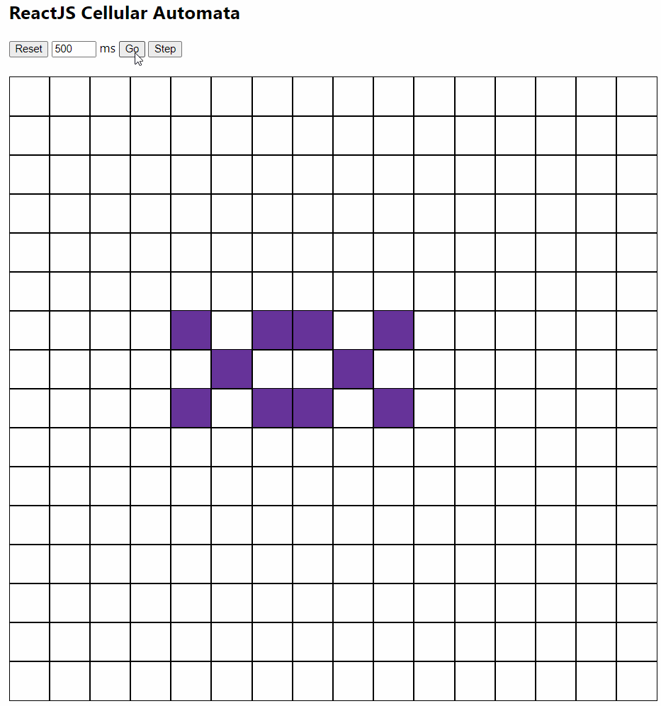

# Conway's Game of Life in ReactJS

This project implements [Conway's Game of Life](https://en.wikipedia.org/wiki/Conway%27s_Game_of_Life) using ReactJS and Node for computation and input/output. Done as a little fun project to learn React.

## Running it

Download the code and in the `automata` folder type

`npm start`

Defaults to [http://localhost:3000](http://localhost:3000) in your browser.

## What you can do

- Click the squares to toggle alive/dead cells.
- Click Go to start the simulation and click Stop to halt.
- Click Step to advance the simulation one cycle.
- Click Reset to clear the state and cycle count.
- You can adjust the tick speed between cycles in milliseconds.\
(This field isn't validated or enforced yet so it might be funky if you feed it something other than a positive integer.)

## Potential extensions

- Adjustable rows and columns.
- Changing/swappable automata rules.
- Multiple cell types to let different colonies battle.
- Loading and saving states to share, revisit and study.
- Adding default patterns for demonstration purposes.
- Stepping back or jumping in time.
- Graphical fun like changing tile colours.